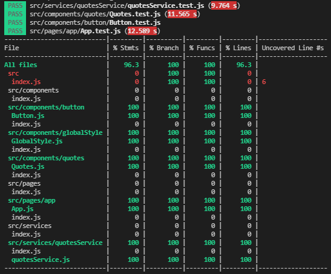

<br />

## naturo-quotes
Gerador de citações do naruto. Desenvolvido como parte do curso de Introdução aos React Hooks, oferecido pela Digital Inovation One.

## Descrição da aplicação

Neste projeto, as citações foram geradas a partir do consumo da API desenvolvida pelo instrutor do curso, que pode ser acessada [neste link](https://github.com/celso-henrique/naruto-quotes-server).

A construção da interface foi feita com React, utilizando as boas práticas da componentização. Para estilização, foi utilizada a biblioteca styled components.

O projeto foi desenvolvido seguindo os princípios do TDD, com os testes construídos com o auxílio da biblioteca [Testing Library](https://testing-library.com/docs/react-testing-library/intro/) do React, atingindo uma cobertura de código de 96.3. Para realizar os testes unitários do módulo de serviço, responsável por enviar a requisição à API, foi utilizada a solução [msw](https://mswjs.io) para mockar as requisições à API.



## Executar localmente

Para rodar o projeto, primeiramente, é preciso clonar ou fazer o download do [repositório da API](https://github.com/celso-henrique/naruto-quotes-server) e executar os passos descritos no [readme](https://github.com/celso-henrique/naruto-quotes-server#readme). Em seguida, basta clonar ou fazer o download deste repositório, instalar as dependências e iniciar a aplicação.
```sh
//instalando as dependências
npm install 

//executando a aplicação
npm start
```

## 🛠 Tecnologias utilizadas:

- [React](https://pt-br.reactjs.org)
- [Styled components](https://styled-components.com)
- [React testing library](https://testing-library.com/docs/react-testing-library/api/)
- [Mock Service Worker](https://mswjs.io)
- [HTML](https://html.spec.whatwg.org/multipage/)
- [CSS](https://www.w3.org/TR/CSS/#css)
- [JavaScript](https://developer.mozilla.org/en-US/docs/Web/JavaScript)

## 🧔 Autor
 

Feito com ❤️ por Gustavo Oliveira Dias 👋🏽

[](https://www.linkedin.com/in/tgmarinho/) 
[](mailto:gustavodias.god@gmail.com)


## 🔑 Licença 

Este projeto está sob licença do [MIT](https://opensource.org/licenses/mit-license.php).
